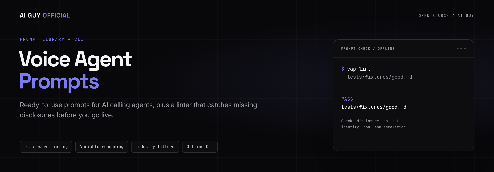
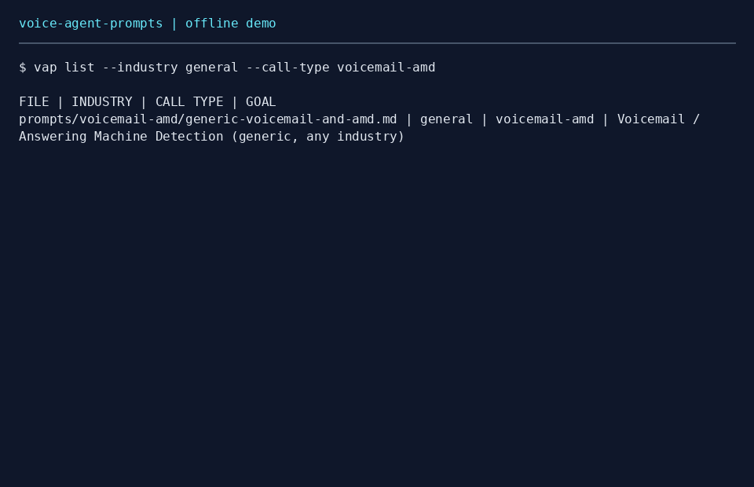
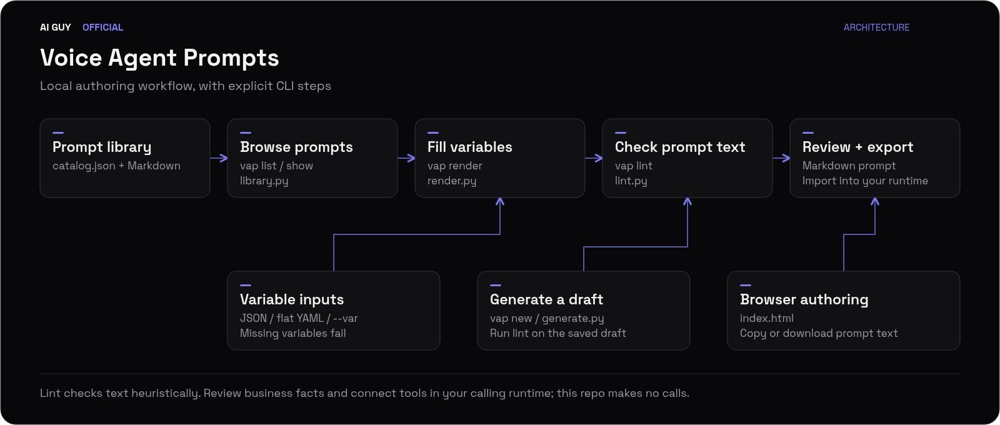

<p align="center">
  
</p>

<p align="center">
  <strong>Ready-to-use prompts for AI calling agents, plus a linter that catches missing disclosures before you go live.</strong>
</p>

<p align="center">
  <a href="https://github.com/jbrazy480/voice-agent-prompts/actions/workflows/ci.yml"></a>
  <a href="LICENSE"></a>
  
  
  <a href="https://www.skool.com/evolving-ai-hub?utm_source=github&utm_medium=readme&utm_campaign=voice-agent-prompts&utm_content=community"></a>
  <a href="https://rizzdial.com/booked?utm_source=github&utm_medium=readme&utm_campaign=voice-agent-prompts&utm_content=done-for-you"></a>
</p>

<p align="center">
  <a href="https://www.skool.com/evolving-ai-hub?utm_source=github&utm_medium=readme&utm_campaign=voice-agent-prompts&utm_content=community"></a>
  <a href="https://rizzdial.com/booked?utm_source=github&utm_medium=readme&utm_campaign=voice-agent-prompts&utm_content=done-for-you"></a>
  <a href="https://aiguyofficial.com/resources?utm_source=github&utm_medium=readme&utm_campaign=voice-agent-prompts&utm_content=resources"></a>
</p>

<p align="center">
  Use the library and CLI yourself, ask questions in the free community, or have the RizzDial team set up AI calling for your business.
</p>

## Demo



The terminal demo above runs `vap list`, `vap lint`, and `vap render` end to end, offline, with no API keys.

## What it does

<table>
<tr>
<td width="33%">

**41 prompts, 21 industries**
Inbound, outbound opt-in, outbound cold, reactivation, and voicemail / AMD prompts, organized by call type and industry.

</td>
<td width="33%">

**Offline linter**
Checks identity, goal, disclosure, opt-out, human escalation, outbound machine handling, restricted vocabulary, and length.

</td>
<td width="33%">

**Variable rendering**
Fill `{{variables}}` from CLI flags or a JSON / flat YAML file. Missing values fail explicitly instead of shipping blank text.

</td>
</tr>
<tr>
<td width="33%">

**`vap` CLI**
`list`, `show`, `render`, `lint`, and `new` commands, plus a `python -m voice_agent_prompts` entry point.

</td>
<td width="33%">

**Browser prompt maker**
[index.html](index.html) generates, copies, or downloads a prompt entirely in the browser. No server, no account.

</td>
<td width="33%">

**Non-interactive generator**
`generate.py` scaffolds a prompt from company and industry flags, for scripting or CI.

</td>
</tr>
<tr>
<td width="33%">

**Claude Code / Codex skill**
The bundled [voice-ai-prompt-builder](skills/voice-ai-prompt-builder/SKILL.md) skill guides an agent through authoring and linting a prompt.

</td>
<td width="33%">

**Zero runtime dependencies**
The Python package uses only the standard library. Wheels bundle the catalog and prompts.

</td>
<td width="33%">

**CI across 3 Python versions**
GitHub Actions runs the test suite, the demo GIF script, and a package build on Python 3.11, 3.12, and 3.13.

</td>
</tr>
</table>

## Who this is for

Agency builders, prompt authors, and teams reviewing calling scripts. Start with the [prompt index](prompts/README.md). The field-tested collection describes conversation patterns without claiming measured results.

## Quickstart

### Can I try the offline demo in 60 seconds?

With Python 3.11 or newer installed:

```bash
python -m venv .venv
source .venv/bin/activate
pip install -e .
vap list --industry general --call-type voicemail-amd
vap lint prompts/voicemail-amd/generic-voicemail-and-amd.md
vap render examples/demo.md --var company=Acme
```

No keys, accounts, or network calls are needed to run the commands after installation. On Windows, activate with `.venv\Scripts\activate`. `python -m voice_agent_prompts` supports the same commands.

```bash
vap show solar-outbound-cold
vap new --vertical hvac --out draft.md
vap lint draft.md
python generate.py --non-interactive --company Acme --industry roofing --print
```

Open `index.html` directly in your browser to generate, copy, or download a prompt. The browser generator runs locally. Business facts in presets are illustrative and require review.

<details>
<summary>How do I use this for real phone calls?</summary>

<br>

This repository authors text and contains no telephony runtime. Render and review a prompt, then import it into your chosen calling platform. Configure consent enforcement, DNC suppression, booking tools, machine detection, and transfers there. The function names in prompts do not execute actions. Provider credentials and webhooks belong in that separate application.

</details>

## How it works

<p align="center">
  
</p>

1. The catalog indexes every prompt by industry and call type.
2. `vap list` and `vap show` browse the catalog from the terminal.
3. `vap render` fills `{{variables}}` from CLI flags or a JSON / flat YAML file.
4. `vap lint` checks the rendered text against the disclosure, opt-out, escalation, and length rules.
5. `vap new` and `generate.py` scaffold a fresh prompt from your business details, ready for the same lint step.
6. `index.html` runs the same generator in the browser, for anyone who prefers a GUI to a terminal.

## Configuration

| Environment variable | Required | Purpose |
|---|---|---|
| None | No | The CLI and browser maker run without keys. |

Use `--vars variables.json` or `--vars variables.yaml` for rendering. JSON accepts a flat object of non-null scalar values. YAML supports flat `key: value` mappings, quoted strings, and comment lines; nested mappings, lists, tags, anchors, and multiline values are rejected. Use JSON for values requiring precise scalar types. CLI `--var` entries override file values. Substitution is a single pass; values containing braces are preserved as literal text.

```json
{"company": "Acme"}
```

```bash
vap render examples/demo.md --vars variables.json --out rendered.md
vap lint rendered.md --call-type outbound-optin --max-length 24000
```

The default length budget is a configurable authoring limit, not a measured platform limit. Warnings alone exit successfully; `--strict` makes warnings fail. Lint failures return status 1; invalid arguments or unreadable input return status 2. Unknown local prompts default to outbound rules unless `--call-type inbound` is supplied.

## Testing

```bash
pip install -e . -r requirements-dev.txt
pytest -q
python scripts/make_demo_gif.py
```

123 tests pass as of this release, covering rule failures, every shipped prompt, rendering and missing variables, CLI errors, list filtering, generator smoke tests, and packaged-library consistency. Tests use no network or API keys. The GIF script executes the offline demo and renders its actual output with Pillow.

## Compliance note (not legal advice)

Calling real people with AI voices is regulated. The FCC confirms that AI-generated voices fall within the TCPA's artificial or prerecorded voice restrictions. Consent requirements, exemptions, and other obligations depend on the call and jurisdiction. See the [FCC declaratory ruling](https://docs.fcc.gov/public/attachments/FCC-24-17A1.pdf). Review applicable rules before calling. A cold-call template is not permission to call, and disclosure alone does not establish consent. Text instructions cannot enforce suppression or validate legal compliance.

## How does this compare?

| Approach | Starting point | You implement | Hosting |
|---|---|---|---|
| This library | Editable prompts and offline lint | Calling runtime, tools, consent controls | Your choice |
| Build from scratch | Your own scripts | Authoring, validation, runtime, tools | Your choice |
| Hosted platform | Provider-specific tooling | Account setup and campaign review | Provider-managed |

## Want this done for you?

This starter gives you the prompts and the linter. If you run an agency, a local business, or a sales team and want the calling runtime, dialer, and CRM handled for you, the RizzDial team can set that up.

RizzDial is a commercial platform for agencies and GoHighLevel users. The team can set up:

- AI voice agents and AI calling built on this prompt structure
- Predictive, power, and parallel dialing
- Answering machine detection
- Built-in CRM, plus GoHighLevel, HubSpot, and Salesforce integrations
- An MCP connection so Claude and ChatGPT can work with your calling data

Product page: [rizzdial.com/ai-dialer](https://rizzdial.com/ai-dialer?utm_source=github&utm_medium=readme&utm_campaign=voice-agent-prompts&utm_content=product). Free training: [rizzdial.com/free-training](https://rizzdial.com/free-training?utm_source=github&utm_medium=readme&utm_campaign=voice-agent-prompts&utm_content=free-training). To talk it through first: [book a call](https://rizzdial.com/booked?utm_source=github&utm_medium=readme&utm_campaign=voice-agent-prompts&utm_content=done-for-you).

## FAQ

### Is this free?

Yes. The prompts, the CLI, the linter, and the browser maker are MIT licensed and free to use and modify.

### Does this make phone calls?

No. It creates and checks text for a separate calling system.

### Can I use it with my calling platform?

Yes. Adapt the variable names and function placeholders to that platform's supported tools.

### Does passing lint make a prompt ready to deploy?

No. Checks are heuristic and can miss contradictory or ineffective instructions. Review the conversation, verify business facts, and test runtime behavior.

### Can I edit the field-tested prompts?

Yes. They are MIT licensed templates. The label does not imply a quantified outcome or guarantee.

### Is RizzDial open source?

No. RizzDial is a commercial platform. Only this repository's code and prompts are MIT licensed.

### How do I get help?

Ask in the [Evolving AI Hub](https://www.skool.com/evolving-ai-hub?utm_source=github&utm_medium=readme&utm_campaign=voice-agent-prompts&utm_content=community), James Hill's free Skool community. For file-specific questions, open a GitHub issue.

## Going further

<p align="center">
  <a href="https://www.skool.com/evolving-ai-hub?utm_source=github&utm_medium=readme&utm_campaign=voice-agent-prompts&utm_content=community"></a>
  <a href="https://rizzdial.com/booked?utm_source=github&utm_medium=readme&utm_campaign=voice-agent-prompts&utm_content=done-for-you"></a>
  <a href="https://aiguyofficial.com/resources?utm_source=github&utm_medium=readme&utm_campaign=voice-agent-prompts&utm_content=resources"></a>
</p>

## License

[MIT](LICENSE), this library and starter only. Copyright (c) 2026 James Hill.

Built by [James Hill (The AI Guy)](https://aiguyofficial.com?utm_source=github&utm_medium=readme&utm_campaign=voice-agent-prompts&utm_content=author).

### More free starters

- [AI Receptionist](https://github.com/jbrazy480/ai-receptionist)
- [AI Cold Calling Agent](https://github.com/jbrazy480/ai-cold-calling-agent)
- [TCPA Compliance Checklist](https://github.com/jbrazy480/tcpa-compliance-checklist)
- [Phone MCP Server](https://github.com/jbrazy480/phone-mcp-server)
