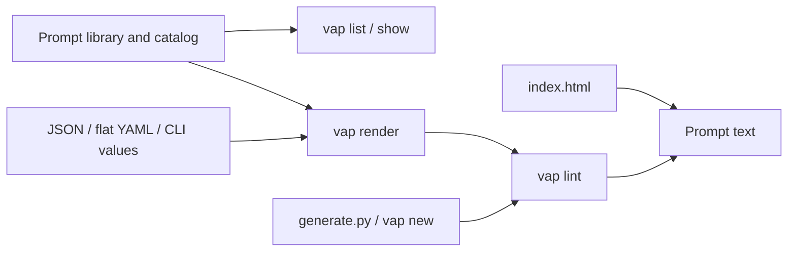
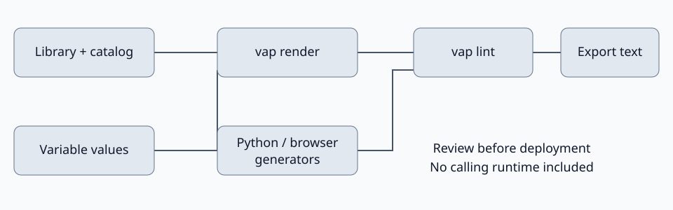

# Voice agent prompts: a prompt library and linter for AI calling agents

**Voice agent prompts is an MIT prompt library and offline linter for AI calling agents.**

[](https://github.com/jbrazy480/voice-agent-prompts/actions/workflows/ci.yml)
[](LICENSE)

[](https://aiguyofficial.com/resources?utm_source=github&utm_medium=readme&utm_campaign=voice-agent-prompts)


## What it does

- Browse inbound, outbound opt-in, outbound cold, reactivation, and voicemail / AMD prompts by industry.
- Render `{{variables}}` from command-line values or a JSON / flat YAML file; missing values fail explicitly.
- Lint identity, goal, disclosure, opt-out, human escalation, outbound machine handling, restricted vocabulary, and prompt length.
- Generate editable scripts using `vap new`, `generate.py`, or the browser maker in [index.html](index.html).
- Use the bundled [Claude Code / Codex skill](skills/voice-ai-prompt-builder/SKILL.md) to guide authoring.

## Who this is for

Agency builders, prompt authors, and teams reviewing calling scripts. Start with the [prompt index](prompts/README.md). The field-tested collection describes conversation patterns without claiming measured results.

## Quickstart

### Can I try the offline demo in 60 seconds?

With Python 3.11 or newer installed:

```bash
python -m venv .venv
source .venv/bin/activate
pip install -e .
vap list --industry general --call-type voicemail-amd
vap lint prompts/voicemail-amd/generic-voicemail-and-amd.md
vap render examples/demo.md --var company=Acme
```

No keys, accounts, or network calls are needed to run the commands after installation. On Windows, activate with `.venv\Scripts\activate`. `python -m voice_agent_prompts` supports the same commands.

```bash
vap show solar-outbound-cold
vap new --vertical hvac --out draft.md
vap lint draft.md
python generate.py --non-interactive --company Acme --industry roofing --print
```

Open `index.html` directly in your browser to generate, copy, or download a prompt. The browser generator runs locally. Business facts in presets are illustrative and require review.

### How do I use this for real phone calls?

This repository authors text and contains no telephony runtime. Render and review a prompt, then import it into your chosen calling platform. Configure consent enforcement, DNC suppression, booking tools, machine detection, and transfers there. The function names in prompts do not execute actions. Provider credentials and webhooks belong in that separate application.

## Configuration

| Environment variable | Required | Purpose |
|---|---|---|
| None | No | The CLI and browser maker run without keys. |

Use `--vars variables.json` or `--vars variables.yaml` for rendering. JSON accepts a flat object of non-null scalar values. YAML supports flat `key: value` mappings, quoted strings, and comment lines; nested mappings, lists, tags, anchors, and multiline values are rejected. Use JSON for values requiring precise scalar types. CLI `--var` entries override file values. Substitution is a single pass; values containing braces are preserved as literal text.

```json
{"company": "Acme"}
```

```bash
vap render examples/demo.md --vars variables.json --out rendered.md
vap lint rendered.md --call-type outbound-optin --max-length 24000
```

The default length budget is a configurable authoring limit, not a measured platform limit. Warnings alone exit successfully; `--strict` makes warnings fail. Lint failures return status 1; invalid arguments or unreadable input return status 2. Unknown local prompts default to outbound rules unless `--call-type inbound` is supplied.

## Architecture





The Python package uses only the standard library. Wheels bundle the catalog and prompts. `generate.py` remains the shared Python generator; the browser keeps its own local generator. `scripts/bundle_library.py` refreshes package data after library edits.

## How does the agent transfer a call?

The prompts instruct the agent to confirm human availability and request a transfer. Your calling platform must implement that action and a fallback when no human is available. The linter only checks text.

## How much does it cost to run?

The library and offline tools require no paid service. Live calls incur charges from your chosen platform and providers; check their pricing before deployment. RizzDial is a separate [commercial platform](https://rizzdial.com/ai-dialer).

## Testing

```bash
pip install -e . -r requirements-dev.txt
pytest -q
python scripts/make_demo_gif.py
```

Tests cover rule failures, every shipped prompt, rendering and missing variables, CLI errors, list filtering, generator smoke tests, and packaged-library consistency. Tests use no network or API keys. The GIF script executes the offline demo and renders its actual output with Pillow.

## Compliance note (not legal advice)

Calling real people with AI voices is regulated. The FCC confirms that AI-generated voices fall within the TCPA's artificial or prerecorded voice restrictions. Consent requirements, exemptions, and other obligations depend on the call and jurisdiction. See the [FCC declaratory ruling](https://docs.fcc.gov/public/attachments/FCC-24-17A1.pdf). Review applicable rules before calling. A cold-call template is not permission to call, and disclosure alone does not establish consent. Text instructions cannot enforce suppression or validate legal compliance.

## How does this compare?

| Approach | Starting point | You implement | Hosting |
|---|---|---|---|
| This library | Editable prompts and offline lint | Calling runtime, tools, consent controls | Your choice |
| Build from scratch | Your own scripts | Authoring, validation, runtime, tools | Your choice |
| Hosted platform | Provider-specific tooling | Account setup and campaign review | Provider-managed |

## FAQ

### Does this make phone calls?

No. It creates and checks text for a separate calling system.

### Can I use it with my calling platform?

Yes. Adapt the variable names and function placeholders to that platform's supported tools.

### Does passing lint make a prompt ready to deploy?

No. Checks are heuristic and can miss contradictory or ineffective instructions. Review the conversation, verify business facts, and test runtime behavior.

### Can I edit the field-tested prompts?

Yes. They are MIT licensed templates. The label does not imply a quantified outcome or guarantee.

### Is RizzDial included in the MIT license?

No. Only this repository's code and prompts are MIT licensed. RizzDial is a commercial platform.

## Going further

Free resources, templates and community: [AI Guy resources](https://aiguyofficial.com/resources?utm_source=github&utm_medium=readme&utm_campaign=voice-agent-prompts).

When you need this across many client numbers with a dialer and CRM built in, RizzDial is a commercial platform for that: [RizzDial AI dialer](https://rizzdial.com/ai-dialer?utm_source=github&utm_medium=readme&utm_campaign=voice-agent-prompts).

## License

[MIT](LICENSE), this library and starter only. Copyright (c) 2026 James Hill.

Maintained by James Hill (The AI Guy).
